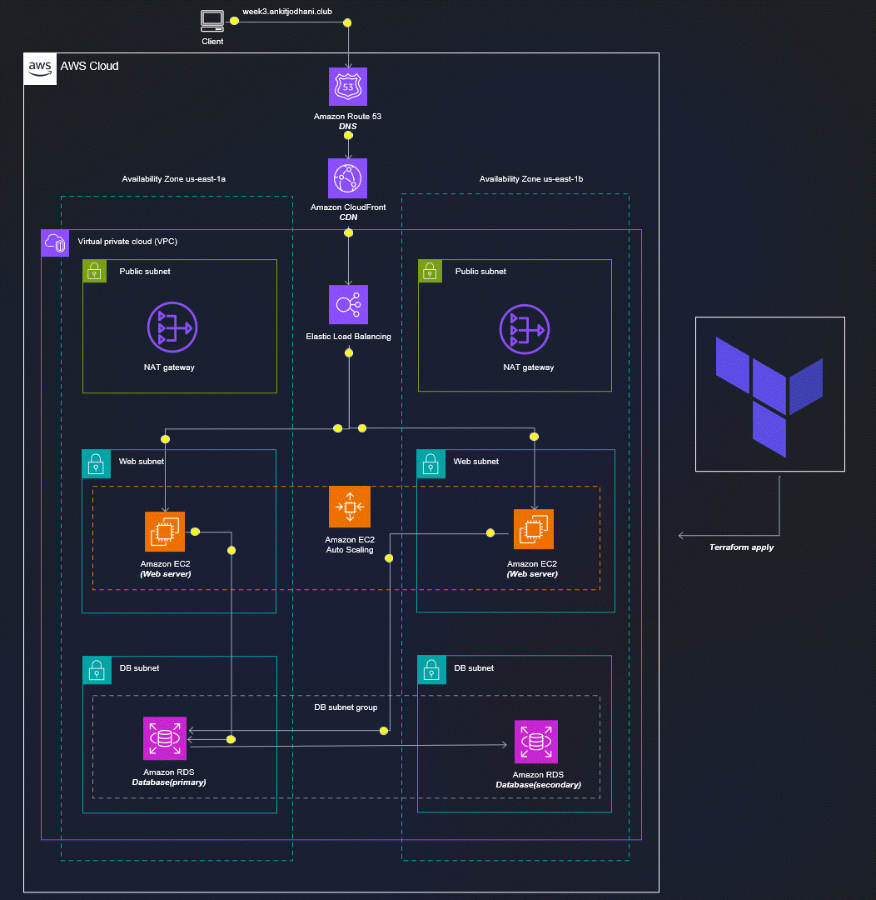

# 🚀 3rdWeeksofCloudOps - 2 tier Application throgh terraform 

✨This repository is created to learn and deploy  2-tier application on aws cloud through terraform. 

## 🏠 Architecture


## 🖥️ Installation of Terraform

**Note**: Follow blog to Install the Terraform and other dependency. [Terrafrom]()

👉 let install dependency to deploy the application 

```sh
cd book_shop_app
terraform init 
```

**Note**: we need public key and private key for our server so follow below procedure.

```sh
cd modules/key/
ssh-keygen.exe 
```
above command ask for key name then give `client_key` it will create pair of keys one public and one private. you can give any name you want but then you need to edit the terraform file

edit below file accoding to your configuration
```sh
vim book_shop_app/backend.tf
```
add below code in book_shop_app/backend.tf
```sh
terraform {
  backend "s3" {
    bucket = "BUCKET_NAME"
    key    = "backend/FILE_NAME_TO_STORE_STATE.tfstate"
    region = "us-east-1"
    dynamodb_table = "dynamoDB_TABLE_NAME"
  }
}
```
### 🏠Lets setup the variable for our Infrastructure
create one file with the name of `terraform.tfvars` 
```sh
vim book_shop_app/terraform.tfvars
```

add below contents into `book_shop_app/terraform.tfvars` file
```javascript
REGION                  = ""
PROJECT_NAME            = ""
VPC_CIDR                = ""
PUB_SUB_1_A_CIDR        = ""
PUB_SUB_2_B_CIDR        = ""
PRI_SUB_3_A_CIDR        = ""
PRI_SUB_4_B_CIDR        = ""
PRI_SUB_5_A_CIDR        = ""
PRI_SUB_6_B_CIDR        = ""
DB_USERNAME             = ""
DB_PASSWORD             = ""
CERTIFICATE_DOMAIN_NAME = ""
ADDITIONAL_DOMAIN_NAME  = ""


```

## ✈️ Now we are ready to deploy our application on cloud ⛅
get into project directory 
```sh
cd book_shop_app
```

type below command to see plan of the exection 
```sh
terraform plan
```

✨Finally, HIT the below command to deploy the application...
```sh
terraform apply 
```

type `yes`, it will prompt you for permission..

**Thank you so much for reading..😅**

